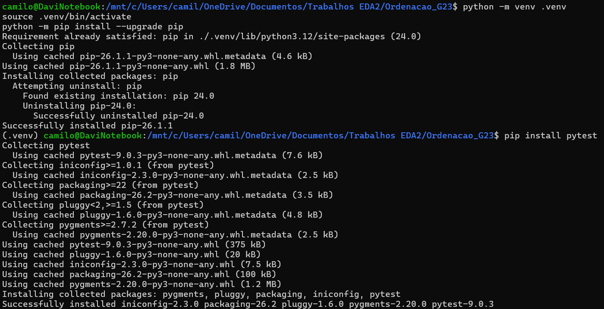
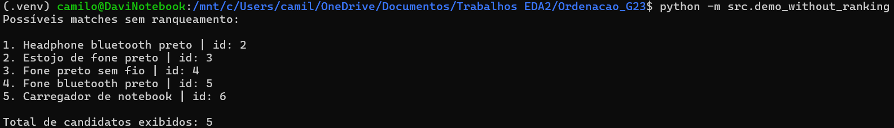
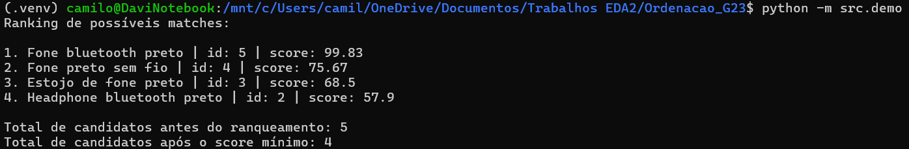
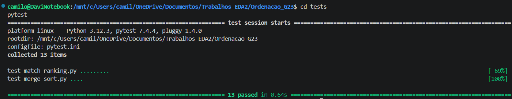

# AcheiUnB

**Número da Lista**: 2<br>
**Conteúdo da Disciplina**: Ordenação<br>

## Alunos
| Matrícula | Aluno |
| -- | -- |
| 23/1011220  |  Davi Camilo Menezes |
| 23/1026714  |  Euller Júlio da Silva |

## Apresentação do trabalho
[Link para o vídeo de apresentação]([TODO: Inserir link do vídeo aqui])

## Sobre
O [AcheiUnB](https://github.com/unb-mds/2024-2-AcheiUnB) é um projeto criado para facilitar a busca e a recuperação de itens perdidos na Universidade de Brasília, permitindo que estudantes cadastrem objetos, perdidos ou encontrados, em uma plataforma mais organizada e acessível do que grupos de mensagens informais.

Este trabalho tem como objetivo aprimorar a recomendação de itens encontrados (matches), a partir da implementação de um sistema de ranqueamento. A ideia principal é calcular um **score de similaridade** entre o item perdido e os possíveis candidatos encontrados, e então, ordenar esses candidatos de forma decrescente utilizando o algoritmo de **Merge Sort** implementado manualmente. Isso permite que o usuário veja primeiro os itens que têm maior probabilidade de ser o seu objeto perdido, já desconsiderando itens filtrados por `status + categoria + local` que, entretanto, possuem baixa compatibilidade (score abaixo de 36) com o item alvo.

Dentre os algoritmos de ordenação estudados, o Merge Sort foi escolhido principalmente por garantir complexidade de tempo `O(n log n)` em todos os casos, inclusive no pior cenário, oferecendo um desempenho previsível para ordenar os candidatos de match pelo score de similaridade. Além disso, por ser um algoritmo **estável**, ele preserva a ordem relativa entre candidatos que obtenham a mesma pontuação.

Quanto ao cálculo do score de similaridade, foram considerados diferentes atributos do item com pesos proporcionais a sua relevância para o match, sendo eles:

| Critério de similaridade | Peso |
| --- | ---: |
| Nomes | 40% |
| Descrições | 25% |
| Cores | 15% |
| Marcas | 15% |
| Proximidade das datas | 5% |

## Screenshots
A seguir estão imagens do projeto em funcionamento.

### Execução local do trabalho de EDA2



Mostra a criação e ativação do ambiente virtual + a instalação da dependência para rodar os testes automatizados.



Execução do script de demonstração `demo_without_ranking.py`, que simula o comportamento anterior à implementação deste trabalho. Nesse cenário, os itens candidatos já foram previamente filtrados por `status`, `categoria` e `local`, mas ainda não passam por ranqueamento com base em similaridade.



Execução do script de demonstração `demo.py`, que simula o comportamento após a implementação deste trabalho. Além da filtragem inicial por `status`, `categoria` e `local`, os candidatos passam a receber um score de similaridade e são ordenados de forma decrescente com o uso do Merge Sort.

#### Comparação de resultados

Ao comparar os dois scripts, percebe-se que `demo_without_ranking.py` apenas apresenta os itens que passaram pelos filtros iniciais, sem priorizar aqueles com maior compatibilidade com o item perdido. Já em `demo.py`, os candidatos são ranqueados conforme o score de similaridade, fazendo com que os itens mais prováveis apareçam primeiro.

Também é possível observar que o item "Carregador de notebook" deixa de ser considerado um possível match na versão com ranqueamento. Embora possua a mesma data da postagem do item perdido, ele obteve score inferior ao mínimo definido de **36**, por apresentar baixa ou nula compatibilidade nos demais atributos analisados. Dessa forma, a nova implementação não apenas ordena os candidatos, mas também descarta correspondências pouco relevantes para o usuário.

### Execução local dos testes



Para garantir que a ordenação e o cálculo de score estão funcionando como esperado, foram criados arquivos de testes automatizados (`test_merge_sort.py` e `test_match_ranking.py`), os quais foram concluídos com sucesso.

## Instalação
**Linguagem**: Python<br>
**Framework**: Não foi utilizado<br>
**Pré-requisitos:** Python 3.10+ instalado e `pytest` para rodar os testes<br>

### Como rodar

1. Criar e ativar ambiente virtual (recomendado)

```bash
python -m venv .venv
source .venv/bin/activate
python -m pip install --upgrade pip
```

2. Instalar a dependência necessária para executar os testes

```bash
pip install pytest
```

3. Executar as demonstrações (antes e depois)

```bash
# Versão anterior, sem ranqueamento dos candidatos
python -m src.demo_without_ranking

# Versão com ranqueamento por score de similaridade e Merge Sort
python -m src.demo
```

4. Executar a suíte de testes automatizados

```bash
cd tests
pytest
```

Se `python` não estiver disponível no seu terminal, use `python3` nos comandos acima.

## Uso
Para este projeto de EDA2, o uso principal do núcleo está na validação da ordenação e do ranqueamento, seguindo a ideia de:

1. Entender como a função de *score* foi montada para atributos categóricos e de texto.
2. Validar a corretude do **Merge Sort** ao ordenar listas de candidatos (matches) através dos testes automatizados.
3. Comparar os resultados obtidos através de scripts simulados, os quais evidenciam uma melhora significativa após a implementação do algoritmo.

## Outros
Este repositório não representa o projeto AcheiUnB em si, mas sim o núcleo desacoplado desenvolvido para a disciplina de Estruturas de Dados 2 (EDA2). Sua função é concentrar a implementação do algoritmo de **Ordenação** (Merge Sort) de forma separada, facilitando testes, análise e a validação isolada do ranqueamento. A integração desse módulo ao fluxo real do AcheiUnB já foi realizada no repositório do projeto através do seguinte Pull Request:

[Link para o PR de integração](https://github.com/unb-mds/2024-2-AcheiUnB/pull/314)
